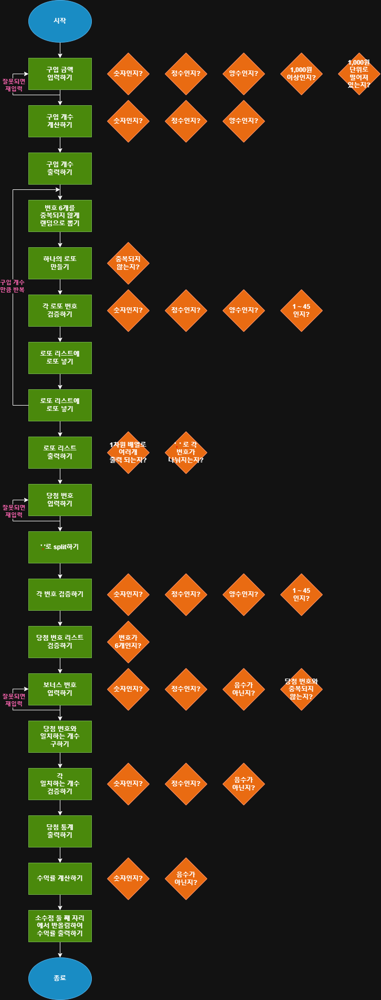

# 프리코스 3주차: 로또

## 문제 소개
간단한 로또 발매기 프로그램입니다.  
사용자가 구입 금액을 입력하면 금액에 맞게 해당 개수만큼 자동으로 로또를 발행하고,  
입력한 당첨 번호, 보너스 번호와 비교하여 당첨 내역 및 수익률을 확인할 수 있습니다.  

단, 잘못된 입력 시 에러 문구 출력 후 해당 지점에서 다시 입력을 받을 수 있게 해야하며, 각 에러는 `[ERROR]` 문구로 시작해야 합니다.

## 실행 방법
```
npm install
npm run start
npm run test
```

</br>

## 구현 기능 정리


<br>

- [x] 1. 구입 금액 구하기
    - [x] 구입 금액 입력하기
    - [x] 검증하기
        - [x] 숫자인지?
        - [x] 정수인지?
        - [x] 양수인지?
        - [x] 1,000원 이상인지?
        - [x] 1,000원 단위로 떨어져있는지?

<br>

- [x] 2. 구입 개수 계산하기
    - [x] 검증하기
        - [x] 숫자인지?
        - [x] 정수인지?
        - [x] 양수인지?

<br>

- [x] 3. 구입 개수 출력하기

<br>

- [x] 4. 로또 번호 계산하기
    - [x] 번호 6개를 중복되지 않게 랜덤으로 뽑기
    - [x] 6개로 하나의 로또 만들기
    - [x] 로또 검증하기
        - [x] 중복되지 않는지?
    - [x] 로또의 번호 검증하기
        - [x] 숫자인지?
        - [x] 정수인지?
        - [x] 양수인지?
        - [x] 1 ~ 45인지?
    - [x] 로또 리스트에 로또 넣기
    - [x] 위 과정을 구입 개수만큼 반복

<br>

- [x] 5. 로또 리스트 출력하기

<br>

- [x] 6. 당첨 번호 구하기
    - [x] 당첨 번호 입력하기
    - [x] `,`로 split하기
    - [x] 당첨 번호 검증하기
        - [x] 숫자인지?
        - [x] 정수인지?
        - [x] 양수인지?
        - [x] 1 ~ 45인지?
    - [x] 당첨 번호 리스트 검증하기
        - [x] 번호가 6개인지?

<br>

- [x] 7. 보너스 번호 구하기
    - [x] 보너스 번호 입력하기
    - [x] 보너스 번호 검증하기
        - [x] 숫자인지?
        - [x] 정수인지?
        - [x] 양수인지?

<br> 

- [x] 8. 계산기 클래스 생성하기

- [x] 9. 당첨 통계 계산하기
    - [x] 일치하는 개수 구하기
    
<br>

- [x] 10. 당첨 통계 출력하기
    - [x] 일치하는 개수에 맞게 출력하기
    - [x] 숫자에 `,`넣어서 format하여 출력하기

<br>

- [x] 11. 수익률 계산하기
    - [x] 일치하는 개수에 맞게 수익 계산하기
    - [x] 수익 / 로또 가격으로 수익률 계산하기

<br>

- [x] 12. 수익률 출력하기
    - [x] 소수점 둘째 자리에서 반올림해서 출력하기

<br />


## 프로그래밍 요구 사항

- indent depth < 3

- 3항 연산자 사용 X

- `Jest`로 전체/단위 테스트하기

- 함수 하나에 15줄 이하 + 한 가지 일만 하도록 최대한 작게 만들기

- else 지양하기

- 코딩 컨벤션 지키기
    ```
    class A {
        필드
        생성자
        메서드
    }
    ```

- 코드 포매팅 사용하기 `Shift+Alt+F`

- JavaScript API 최대한 활용하기 ex) `reduce`, `join`

- `mission-utils` 라이브러리 이용


<br />

## 아키텍처 - MVC + shared
```
|- App. js (controller)
|
|- services/
|   |- InputServices.js
|   |- LottoServices.js
|   |- CalculatorServices.js
|   |- index.js
|
|- models/
|   |- lotto/
|   |   |- Lotto.js
|   |   |- utils/
|   |- calculator/
|   |   |- Calculator.js
|   |   |- utils/
|   |- purchase/
|   |   |- Purchase.js
|   |   |- utils/
|   |- index.js
|
|- views/
|   |- input/ 
|   |   |- Input.js
|   |   |- utils/
|   |- output/
|   |   |- Output.js 
|   |   |- utils/
|   |- index.js
|
|- shared/
|   |- error/
|   |   |- WoowaError.js
|   |   |- utils/ 
|   |- number/
|   |   |- utils/
|   |- test
|   |-  |- checkErrorMessage.js
|   |- index.js  
|  
____________________________
```
**Controller**
- `App (controller)` : 로또 발매기 class

<br>

**Model**
- `Lotto (model)` : 로또 번호 데이터 class
- `Purchase (model)` : 구입 금액 및 개수 계산 class
- `Calculator (model)` : 당첨 통계 계산 class

<br>

**View**
- `Input (view)` : 사용자 입력 처리 class
- `Output (view)` : 결과 출력 class

<br>

**Service**
- `InputService (service)` : 입력 검증 및 재입력 처리 class
- `LottoService (service)` : 로또 번호 생성 관리 class
- `CalculatorService (service)` : 당첨 통계 및 수익률 계산 class

<br>

**Shared**
- `WoowaError (shared)` : 에러 메시지 포맷 class
- `NumberValidator (shared)` : 숫자 검증 class

<br />

## 에러 항목

- **공통 숫자 (Number)**
    - `[ERROR] Non-number` : 숫자가 아닐 때
    - `[ERROR] Non-integer number` : 정수가 아닐 때
    - `[ERROR] Negative number` : 음수일 때
    - `[ERROR] Non-positive number` : 양수가 아닐 때

<br>

- **구입 (Purchase)**
   - `[ERROR] Must not be less than purchase unit` : 1,000원 미만일 때
    - `[ERROR] Must be divisable by purchase unit` : 1,000원 단위가 아닐 때
    - 공통 숫자 검증 적용 (숫자, 정수, 양수)


<br>

- **로또 (Lotto)**
   - `[ERROR] Duplicated number exists` : 중복 번호가 있을 때
    - `[ERROR] Not in range betwwen 1 and 45` : 1~45 범위 밖일 때
    - `[ERROR] Lotto must have 6 numbers` : 번호가 6개가 아닐 때
    - 공통 숫자 검증 적용 (숫자, 정수, 양수)

<br>

- **계산기 (Calculator)**
    - `[ERROR] Bonus number must not be same with winning numbers` : 보너스 번호가 당첨 번호와 중복될 때

<br>

- **출력 format (OutputFormatter)**
    - `[ERROR] Lotto must be sorted ascending` : 로또가 오름차순이 아닐 때
    - `[ERROR] Incorrect position of splitter` : 가격 포맷이 잘못됐을 때
    - `[ERROR] Incorrect rounding of profit` : 수익률 반올림이 잘못됐을 때

<br />

## 테스트

### 전체 테스트
- 전체 기능 테스트 : 2개
- 예외 테스트 : 4개
- 재입력 테스트 : 4개

<br>

### 단위 테스트
- `NumberTest`  
정상 테스트 : 1개  
예외 테스트 : 4개  

<br>

- `PurchaseTest`  
정상 테스트 : 1개  
예외 테스트 : 6개  

<br>

- `LottoTest`  
정상 테스트 : 1개  
예외 테스트 : 5개  
서비스 테스트 : 2개

<br>

- `CalculatorTest`  
정상 테스트 : 1개  
예외 테스트 : 1개  
서비스 테스트 : 2개  

<br>

- `OutputTest`  
출력 테스트 : 9개  
에러 출력 테스트 : 2개  

<br>

- `OutputFormatterTest`  
로또 format 테스트 : 2개  
구입 가격 format 테스트 : 2개  
수익률 format 테스트 : 3개  

<br>

- `InputServiceTest`  
구입 금액 재입력 테스트 : 4개  
로또 재입력 테스트 : 4개  
계산기 재입력 테스트 : 4개  

<br>

- `ErrorTest`  
에러 변환 테스트 : 6개  

<br />

## 참고자료
- [라이브러리 분석 결과](https://quirky-streetcar-a17.notion.site/mission-utils-28c523184d3c80d8904fe0870e5e4181?pvs=74)

- [우테코 Clean Code](https://github.com/woowacourse/woowacourse-docs/blob/main/cleancode/pr_checklist.md
)

- [2주차 회고록](https://velog.io/@gaiogo2/%EC%9A%B0%EC%95%84%ED%95%9C%ED%85%8C%ED%81%AC%EC%BD%94%EC%8A%A4-8%EA%B8%B0-FE-%ED%94%84%EB%A6%AC%EC%BD%94%EC%8A%A4-2%EC%A3%BC%EC%B0%A8-%ED%9A%8C%EA%B3%A0%EB%A1%9D)

- [단위 테스트 정리](https://quirky-streetcar-a17.notion.site/Testing-Jest-297523184d3c807a9402f1f518f31abd)